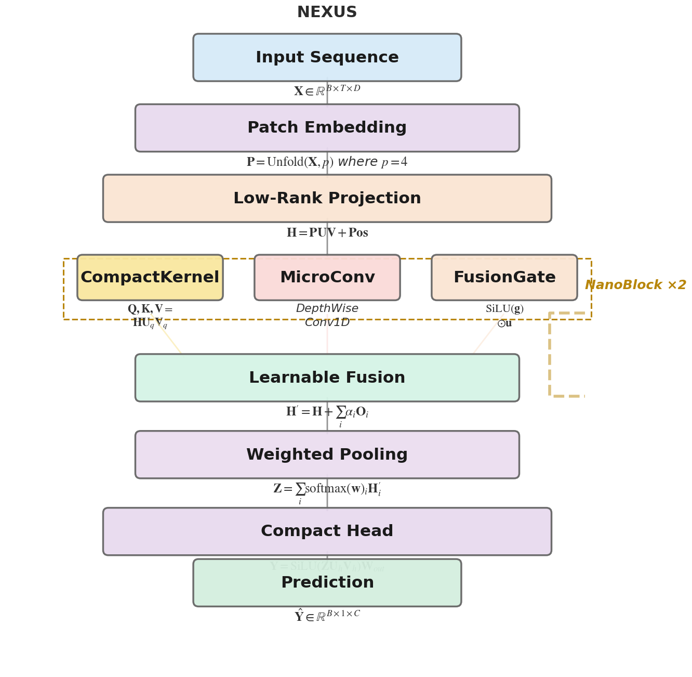
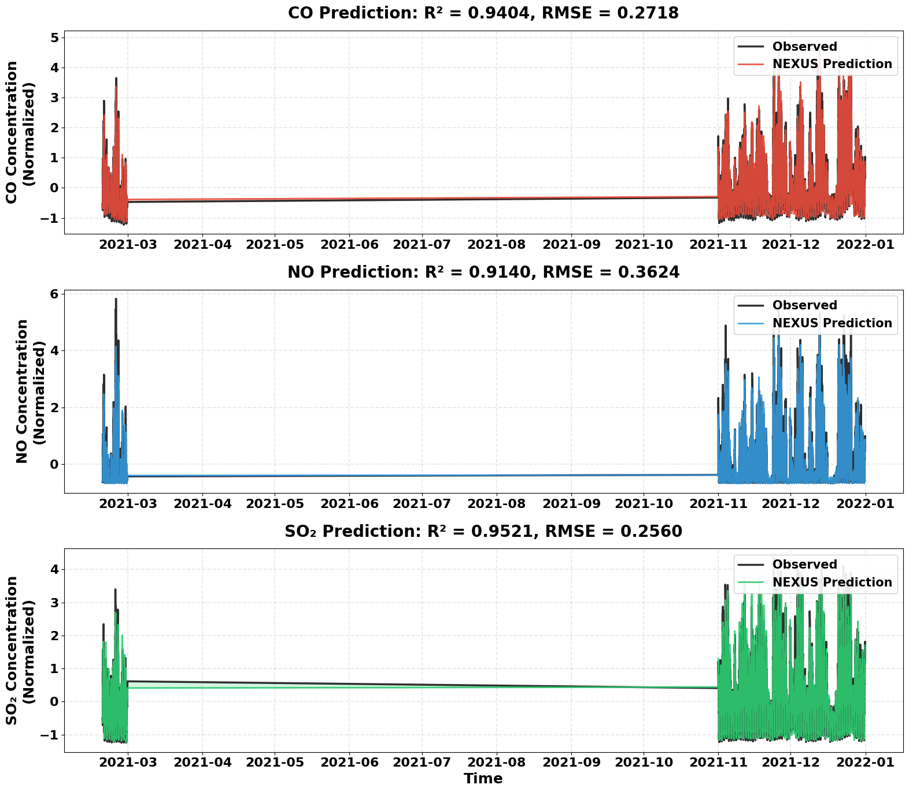
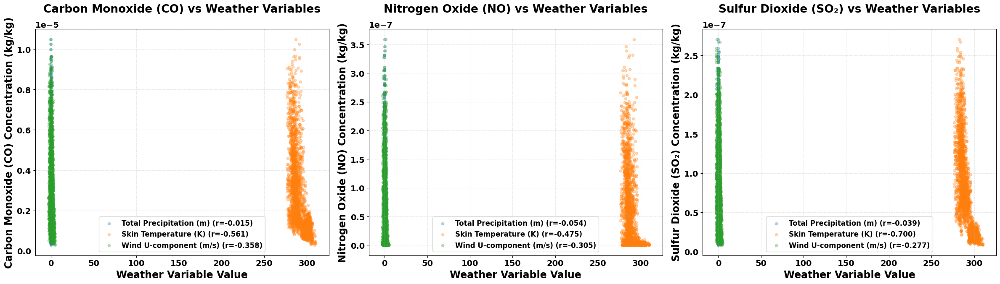
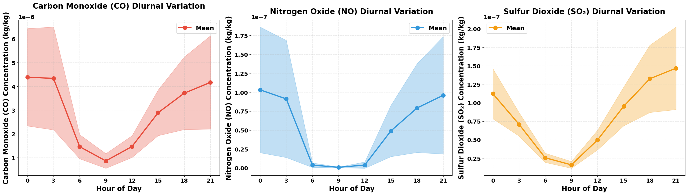
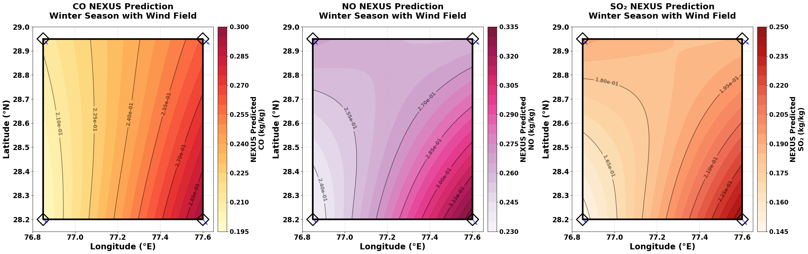
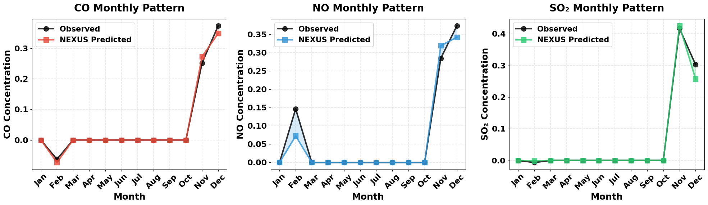
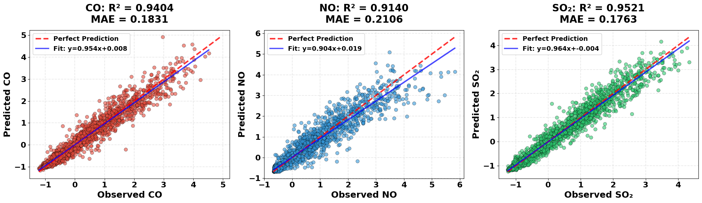

# NEXUS: Neural Extraction and Unified Spatiotemporal Architecture

[](https://colab.research.google.com/drive/1jM0PvfGirVS0hmaNQlrnsqVkqIYJwUax?usp=sharing)

**A Compact Neural Architecture for High-Resolution Spatiotemporal Air Quality Forecasting in Delhi National Capital Region**

*Rampunit Kumar and Aditya Maheshwari*  
*Indian Institute of Management Indore*

---

## 🌟 Overview

NEXUS is a state-of-the-art deep learning architecture designed for efficient and accurate spatiotemporal air quality forecasting. Developed specifically for the Delhi NCR region, it achieves superior predictive performance while using 94% fewer parameters than existing transformer-based models.

### Key Highlights

- **Superior Accuracy**: R² > 0.94 (CO), 0.91 (NO), 0.95 (SO₂)
- **Ultra-Compact**: Only 18,748 parameters (vs. 298,080 for FEDformer)
- **Fast Inference**: 6× faster than competing models
- **Real-Time Ready**: Suitable for operational deployment on standard hardware

---

## 📊 Architecture



NEXUS integrates:
- **Patch Embedding**: Reduces temporal sequence length by 50%
- **Low-Rank Projections**: Captures dominant atmospheric modes
- **NanoBlocks**: Parallel multi-scale feature extraction
- **Adaptive Fusion**: Context-aware spatial pooling

---

## 🎯 Performance Comparison

| Model | Parameters | Avg R² | Avg RMSE | Training Time |
|-------|-----------|--------|----------|---------------|
| SCINet | 35,552 | 0.7531 | 0.5828 | 35 min |
| Autoformer | 68,704 | 0.8804 | 0.4053 | 45 min |
| FEDformer | 298,080 | 0.8747 | 0.4152 | 90 min |
| **NEXUS** | **18,748** | **0.9355** | **0.2967** | **25 min** |

**Improvements over FEDformer**: +6.95% accuracy, -93.71% parameters, -28.53% error

---

## 📈 Key Findings

### Temporal Patterns

*NEXUS accurately captures seasonal pollution cycles and episodic spikes*

### Meteorological Influence

*Strong negative correlations: Temperature (r=-0.56 to -0.70), Wind speed (r=-0.28 to -0.36)*

### Diurnal Cycles

*Morning and evening peaks driven by traffic and boundary layer dynamics*

### Spatial Heterogeneity

*Northwestern regions show elevated concentrations; gradients exceed 2× during episodes*

### Seasonal Variations

*November-December peaks: concentrations 7× higher than summer baseline*

### Prediction Accuracy

*Tight clustering around perfect prediction line; minimal systematic bias*

---

## 🔬 Dataset

**Domain**: Delhi NCR (28.2°N–28.95°N, 76.85°E–77.6°E)  
**Period**: January 2018 – December 2021 (4 years)  
**Temporal Resolution**: 3-hourly  
**Spatial Coverage**: 4 monitoring locations  

**Pollutants**: CO, NO, SO₂ (from Copernicus Atmosphere Monitoring Service)  
**Meteorology**: Precipitation, solar radiation, wind velocity, temperature (from ERA5 Reanalysis)

---

## 🚀 Quick Start

### Open in Google Colab
The complete implementation is available in our interactive notebook:

[](https://colab.research.google.com/drive/1jM0PvfGirVS0hmaNQlrnsqVkqIYJwUax?usp=sharing)

### Key Components
1. **Data Preprocessing**: Spatial alignment, temporal aggregation, robust normalization
2. **Model Training**: Adam optimizer, early stopping, dropout regularization
3. **Evaluation**: 6 metrics (R², RMSE, MAE, sMAPE, IoA, NSE)
4. **Analysis**: Diurnal, seasonal, spatial, and meteorological pattern extraction

---

## 🧪 Ablation Study

| Configuration | Avg R² | ΔR² | Parameters |
|--------------|--------|-----|------------|
| **Full NEXUS** | **0.9355** | **baseline** | **18,748** |
| w/o Patch Embedding | 0.8535 | -8.77% | 24,320 |
| w/o Low-rank Projection | 0.8820 | -5.72% | 22,144 |
| w/o NanoBlock Pathways | 0.8768 | -6.28% | 14,592 |
| w/o Weighted Pooling | 0.8972 | -4.09% | 18,320 |
| Single NanoBlock | 0.8654 | -7.49% | 12,416 |

*Each component contributes significantly to overall performance*

---

## 🎓 Citation

If you use this work, please cite:

```bibtex
@article{kumar2025nexus,
  title={NEXUS: A Compact Neural Architecture for High-Resolution Spatiotemporal Air Quality Forecasting in Delhi National Capital Region},
  author={Kumar, Rampunit and Maheshwari, Aditya},
  journal={Under Review},
  year={2025},
  institution={Indian Institute of Management Indore}
}
```

---

## 📝 Key Contributions

1. **Architectural Innovation**: 94% parameter reduction vs. FEDformer with 6.95% accuracy improvement
2. **Joint Multi-Pollutant Forecasting**: Exploits shared meteorological drivers and inter-species correlations
3. **Comprehensive Analysis**: Diurnal cycles, seasonal patterns, meteorological thresholds, spatial heterogeneity
4. **Practical Deployment**: Real-time capable on standard hardware

---

## 🌍 Impact

**Public Health**: Enables advance warnings for vulnerable populations during pollution episodes  
**Policy Support**: Identifies critical meteorological thresholds and emission hotspots  
**Scientific Insight**: Quantifies temperature inversions, wind impacts, and seasonal dynamics  
**Operational Feasibility**: Low computational requirements enable widespread deployment

---

## 📧 Contact

**Rampunit Kumar** - msdsm03rampunitk@iimidr.ac.in  
**Aditya Maheshwari** - adityam@iimidr.ac.in

*Operations Management and Quantitative Techniques Area*  
*Indian Institute of Management Indore, India*

---

## 📄 License

This project is part of academic research. For commercial use or collaborations, please contact the authors.

---

## 🙏 Acknowledgments

- European Centre for Medium-Range Weather Forecasts (ECMWF) for ERA5 reanalysis data
- Copernicus Atmosphere Monitoring Service (CAMS) for pollutant observations
- IIM Indore for computational resources

---

**⭐ Star this repository if you find it useful!**
